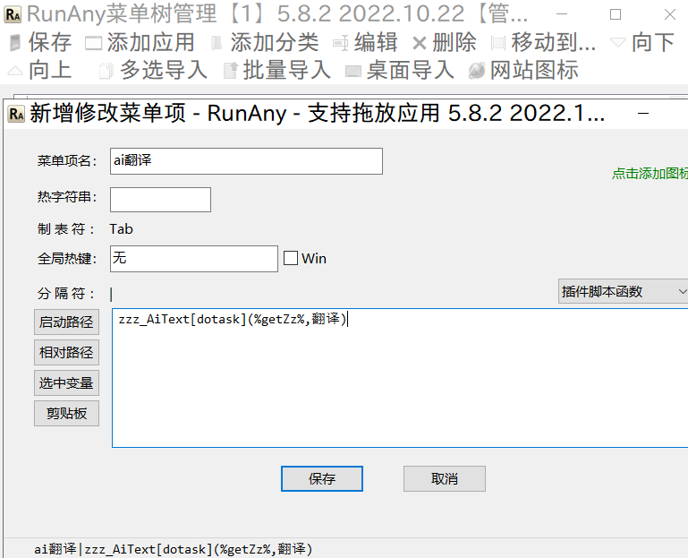
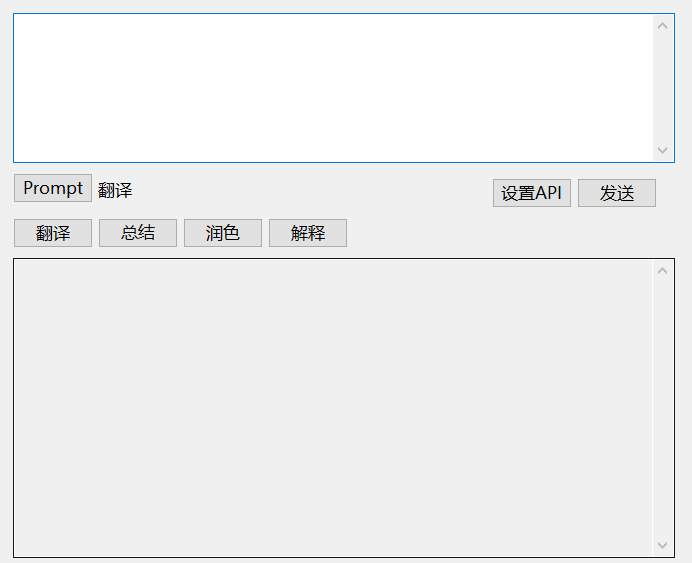
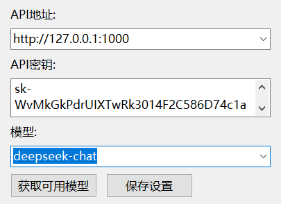
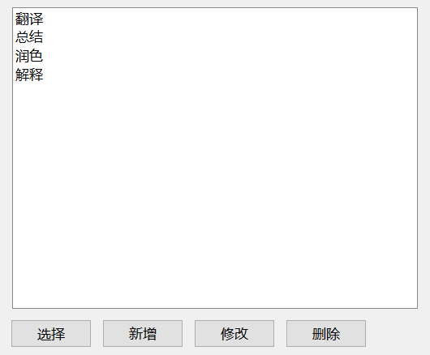

# AHK小工具

## [简单ai处理文本工具-aiText](https://github.com/showyourlucky/ahk_tool/tree/main/aiText)


- zzz_AiText.ahk是根据translator.ahk修改的ranany插件

### translator使用方法

1. 启动[translator.exe](https://github.com/showyourlucky/ahk_tool/blob/main/aiText/translator.exe)

2. 填写api设置

3. 选中prompt提示词

4. 点击发送

   发送按钮使用选择的prompt提示词

   除翻译按钮外, 翻译右侧按钮由其它的prompt生成, 最多生成3个按钮

### zzz_AiText使用方法

1. 进入[RunAny](https://github.com/hui-Zz/RunAny)安装目录下的RunPlugins, 比如D:\RunAny\RunPlugins

2. 新建目录zzz_AiText, 把zzz_AiText.ahk放入zzz_AiText目录中

3. 在RunAny插件管理中设置自启并且启动zzz_AiText.ahk

   
   
4. 在runAny.ini配置中加入配置, 注意“ai翻译”为菜单名, 不要与其它菜单重复, “翻译”prompt中设置的prompt; 也可以在菜单中进行配置
   ```
   ai翻译|zzz_AiText[dotask](%getZz%,翻译)
   ```
    

### 主界面


- 可设置api, 只支持openai格式

  

- prompt提示词可选择, 可新增, 修改, 删除

  

